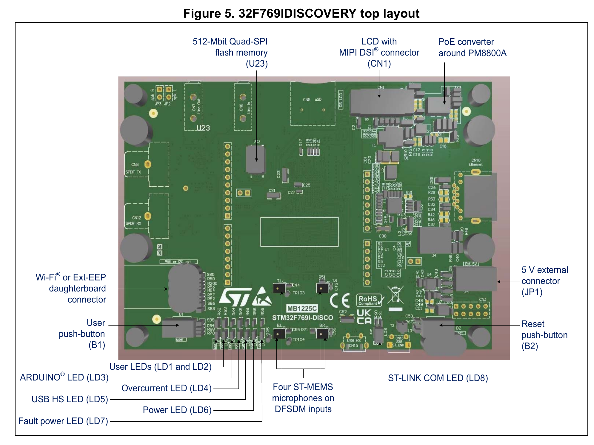
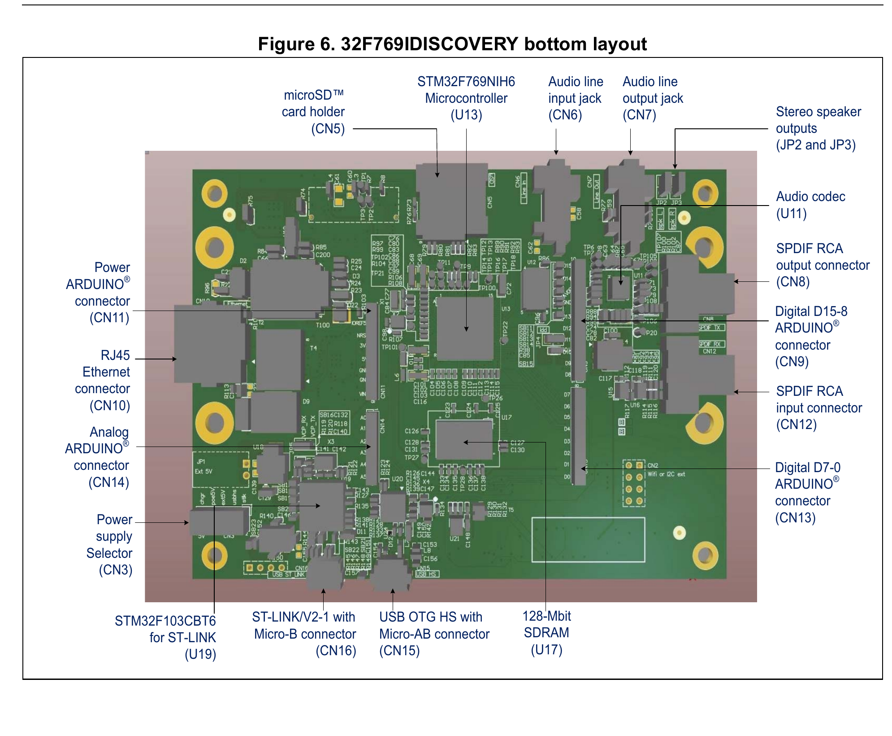

# NTUT MCU Lab

GPIO, UART, ADC, timer, software PWM, and stopwatch practice for the **STM32F769I-DISCO** board using STM32CubeIDE, STM32CubeMX, and the STM32 HAL.

## Hardware and source

- Development board: STM32F769I-DISCO (MB1225, schematic revision B-02)
- MCU: STM32F769NIH6
- Framework: STM32Cube HAL
- Official board manual: [UM2033 - Discovery kit with STM32F769NI MCU](https://www.st.com/resource/en/user_manual/um2033-discovery-kit-with-stm32f769ni-mcu-stmicroelectronics.pdf)
- Official schematic: [MB1225 STM32F769I-DISCO schematic](https://www.st.com/resource/en/schematic_pack/mb1225-f769i-b02_schematic.pdf)

## Before starting: board setup and required peripherals

### Locate the buttons, LEDs, USB connector, and power selector

The top-side drawing identifies the blue user button `B1`, the black reset button `B2`, user LEDs `LD1` and `LD2`, and the red power indicator `LD6`:



The bottom-side drawing identifies the ST-LINK USB connector `CN16`, the separate USB OTG connector `CN15`, and the power-source selector `CN3`:



Source: STMicroelectronics, UM2033, Section 5.1, Figures 5 and 6.

### Connect and power the board

1. Connect a **data-capable USB Micro-B cable** between the PC and **`CN16`**, the onboard ST-LINK/V2-1 connector. This connection provides programming, debugging, the USART1 Virtual COM Port, and the normal USB power path.
2. Check that power selector **`CN3` is set to `stlk`**, the default ST-LINK USB power source described in UM2033 Section 5.4.
3. Confirm that the red **`LD6` power LED** turns on. With the default `stlk` setting, the STM32 side is powered only after the PC successfully enumerates the ST-LINK USB device.
4. If Windows does not recognize the debugger or Virtual COM Port, install ST's [STSW-LINK009 ST-LINK USB driver](https://www.st.com/en/development-tools/stsw-link009.html). ST's [STM32CubeProgrammer](https://www.st.com/en/development-tools/stm32cubeprog.html) can help check the ST-LINK connection or update its firmware when necessary.
5. For UART exercises, open the ST-LINK Virtual COM Port using **115200 baud, 8 data bits, no parity, 1 stop bit, and no flow control**.

`CN15` is the USB OTG HS connector, not the ST-LINK programming or Virtual COM Port connector. A charge-only USB cable cannot provide debugger or serial communication. Do not change the board's solder bridges or install `R138`; UM2033 explicitly warns against connecting `CN16` to a PC when `R138` is soldered.

### Confirm the board-specific GPIO behavior

UM2033 Section 5.16, Table 4 identifies the physical user LEDs as red `LD1 = PJ13` and green `LD2 = PJ5`. This project's generated labels differ from the physical designators: `LED1 = PJ5` therefore controls physical green `LD2`, while `LED2 = PJ13` controls physical red `LD1`.

The same UM2033 section correctly states that blue user button `B1` is high when pressed and low when released. Use `PA0/WKUP` as `GPIO_Input` with `GPIO_NOPULL`; the B-02 schematic already provides the external pull-down resistor.

> **Important LED-polarity correction:** The prose in UM2033 Section 5.16 claims that a low GPIO level turns on a user LED, but that claim conflicts with its own LED descriptions and with the MB1225 B-02 schematic used by this project. The B-02 schematic connects the LED cathodes to ground: `GPIO_PIN_SET` turns physical `LD1` or `LD2` on, and `GPIO_PIN_RESET` turns it off. Use the schematic and the verified firmware behavior for this board revision.

### Open the project and inspect the CubeMX configuration

1. Import the project into STM32CubeIDE and open [`NTUT_MCU_LAB.ioc`](NTUT_MCU_LAB.ioc).
2. Under **Pinout & Configuration**, verify `PJ5 = LED1`, `PJ13 = LED2`, and `PA0/WKUP = USER_BUTTON`.
3. Under **Connectivity > USART1**, enable **Asynchronous** mode with `PA9 = USART1_TX`, `PA10 = USART1_RX`, and `115200 8N1` when the exercise uses the PC serial terminal.
4. Under **Analog > ADC1**, enable the **internal temperature-sensor channel** for LAB4. No wire to Arduino connector `CN14` is required by the existing temperature exercises.
5. Under **Timers > TIM1**, select the internal clock, prescaler `15999`, and counter period `999` for LAB5-1 or LAB5-3-B. Enable the **TIM1 update interrupt** in **System Core > NVIC**.
6. Under **Timers > TIM6**, select the internal clock and prescaler `159` for LAB5-2 or LAB5-3-A. The generated period is `65535`; the software reads the free-running counter and controls `PJ5` as an ordinary GPIO.
7. Under **Clock Configuration**, confirm that the project uses the `16 MHz` internal HSI clock without the PLL, with AHB, APB1, and APB2 dividers all set to `/1`.

The `.ioc` currently also enables `TIM6_DAC_IRQn`, but the existing breathing-LED implementation starts TIM6 without interrupts and reads its counter directly. Therefore, enabling the TIM6 NVIC interrupt is **not required** for LAB5-2 or LAB5-3-A. TIM6 has no PWM output channel, and the onboard LED is not connected to a hardware PWM channel.

### Minimum peripherals needed by each exercise

| Exercise | Enable or verify | Student-visible hardware |
|---|---|---|
| LAB1-1, LAB1-2 | `PJ5` and `PJ13` as push-pull GPIO outputs | Physical user LEDs `LD2` and `LD1`. |
| LAB1-3, LAB1-4 | `PJ5` GPIO output and `PA0` GPIO input, no pull | Blue user button `B1` and physical green LED `LD2`. |
| LAB2-1 | `PJ5`, `PJ13`, and `PA0` GPIO | Blue user button and both physical user LEDs. |
| LAB2-2 | LAB2-1 GPIO plus `USART1` asynchronous TX/RX | Blue user button, both LEDs, and the `CN16` Virtual COM Port. |
| LAB3-1 through LAB3-3-B | `USART1` asynchronous TX/RX on `PA9` and `PA10` | Serial terminal through the existing `CN16` cable. |
| LAB4-1 | `ADC1` internal temperature-sensor channel plus `USART1` | Internal MCU sensor and serial terminal; no external analog wiring. |
| LAB4-2 | LAB4-1 peripherals plus `PJ5` and `PJ13` GPIO outputs | Internal MCU sensor, both user LEDs, and serial terminal. |
| LAB5-1 | `TIM1`, TIM1 update interrupt, and `USART1` | One-second UART clock through `CN16`. |
| LAB5-2 | `TIM6` and `PJ5` GPIO output | Physical green `LD2`; no timer PWM channel or TIM6 interrupt needed. |
| LAB5-3-A | LAB5-2 peripherals plus `USART1` | Physical green `LD2` and serial speed control through `CN16`. |
| LAB5-3-B | `TIM1`, TIM1 update interrupt, `PA0` GPIO input, and `USART1` | Blue button `B1` and UART stopwatch through `CN16`. |

These are the minimum dependencies for each exercise. The shared project initializes GPIO, USART1, ADC1, TIM1, and TIM6 together, even when the currently selected lab does not use every peripheral.

## Lab documentation

### LAB1 - GPIO

- [LAB1-1 - Toggle both LEDs every 500 ms](doc/LAB1-1.md)
- [LAB1-2 - Control each LED explicitly](doc/LAB1-2.md)
- [LAB1-3 - Turn on the LED while the user button is pressed](doc/LAB1-3.md)
- [LAB1-4 - Toggle the LED on each button press](doc/LAB1-4.md)

### LAB2 - GPIO counter and UART

- [LAB2-1 - Display a two-bit button counter on the LEDs](doc/LAB2-1.md)
- [LAB2-2 - Transmit the button counter over USART1](doc/LAB2-2.md)

### LAB3 - Bidirectional UART and algorithms

- [LAB3-1 - Add two multi-digit integers over UART](doc/LAB3-1.md)
- [LAB3-2-A - Generate a Fibonacci sequence over UART](doc/LAB3-2-A.md)
- [LAB3-2-B - Calculate GCD and LCM over UART](doc/LAB3-2-B.md)
- [LAB3-3-A - Play the ultimate password guessing game over UART](doc/LAB3-3-A.md)
- [LAB3-3-B - Sort UART input with Quick Sort](doc/LAB3-3-B.md)

### LAB4 - ADC and internal temperature sensing

- [LAB4-1 - Read the internal temperature sensor with ADC1](doc/LAB4-1.md)
- [LAB4-2 - Control LEDs according to the internal temperature](doc/LAB4-2.md)

### LAB5 - Timers, software PWM, and stopwatch control

- [LAB5-1 - Build a UART clock with a one-second TIM1 interrupt](doc/LAB5-1.md)
- [LAB5-2 - Create a breathing LED with TIM6 and software PWM](doc/LAB5-2.md)
- [LAB5-3-A - Control breathing LED speed over UART](doc/LAB5-3-A.md)
- [LAB5-3-B - Control a stopwatch with short and long button presses](doc/LAB5-3-B.md)

## How to find the original source code

The files under [`doc/`](doc/) explain the circuit, CubeMX settings, and programming concepts. The C source code that runs on the STM32 is stored under [`Core/Src/`](Core/Src/).

### Source-code map

| What you are looking for | Implementation file | Header or related file |
|---|---|---|
| LAB1 GPIO exercises | [`Core/Src/lab01_gpio.c`](Core/Src/lab01_gpio.c) | [`Core/Inc/lab01_gpio.h`](Core/Inc/lab01_gpio.h) |
| LAB2 GPIO counter and UART | [`Core/Src/lab02_uart.c`](Core/Src/lab02_uart.c) | [`Core/Inc/lab02_uart.h`](Core/Inc/lab02_uart.h) |
| LAB3 UART and algorithms | [`Core/Src/lab03_uart2.c`](Core/Src/lab03_uart2.c) | [`Core/Inc/lab03_uart2.h`](Core/Inc/lab03_uart2.h) |
| LAB4 ADC and temperature sensor | [`Core/Src/lab04_adc.c`](Core/Src/lab04_adc.c) | [`Core/Inc/lab04_adc.h`](Core/Inc/lab04_adc.h) |
| LAB5 timers, breathing LED, and stopwatch | [`Core/Src/lab05_timer.c`](Core/Src/lab05_timer.c) | [`Core/Inc/lab05_timer.h`](Core/Inc/lab05_timer.h) |
| Active lab and peripheral initialization | [`Core/Src/main.c`](Core/Src/main.c) | [`Core/Inc/main.h`](Core/Inc/main.h) |
| Timer and peripheral interrupt handlers | [`Core/Src/stm32f7xx_it.c`](Core/Src/stm32f7xx_it.c) | [`Core/Inc/stm32f7xx_it.h`](Core/Inc/stm32f7xx_it.h) |
| Peripheral clocks and NVIC setup | [`Core/Src/stm32f7xx_hal_msp.c`](Core/Src/stm32f7xx_hal_msp.c) | Generated by STM32CubeMX. |
| Complete STM32CubeMX configuration | [`NTUT_MCU_LAB.ioc`](NTUT_MCU_LAB.ioc) | Open this file with STM32CubeMX or the CubeIDE Device Configuration Tool. |

### Find one exercise on GitHub

For example, to find the breathing LED code:

1. Open [LAB5-2 - Create a breathing LED with TIM6 and software PWM](doc/LAB5-2.md) to read the explanation.
2. Open [`Core/Src/lab05_timer.c`](Core/Src/lab05_timer.c) to see the implementation.
3. Use the browser's find function (`Ctrl+F`) and search for `void LAB5_2`.
4. Open [`Core/Src/main.c`](Core/Src/main.c), search for `LAB5_2();`, and make it the only selected lab call.
5. Check `MX_TIM6_Init()` in `main.c` and the TIM6 settings in [`NTUT_MCU_LAB.ioc`](NTUT_MCU_LAB.ioc) if you also need the timer configuration.

The same method works for every exercise: use the lab name shown in this README, open the matching `labXX_*.c` file, and search for the function name such as `LAB1_3`, `LAB3_2_B`, or `LAB5_3_A`.

### Find the code in STM32CubeIDE

1. Expand the project in **Project Explorer**.
2. Open **Core > Src** and select the matching `labXX_*.c` file.
3. Press `Ctrl+F` and search for the lab function name.
4. Open `Core/Src/main.c` to select which lab runs.
5. Open the `.ioc` file when you need to inspect or regenerate GPIO, UART, ADC, or timer settings.

Do not copy only the body of a lab function and assume that it is self-contained. A lab may also depend on its declaration in `Core/Inc`, GPIO names in `main.h`, peripheral handles and initialization in `main.c`, interrupt forwarding in `stm32f7xx_it.c`, or NVIC and clock setup in `stm32f7xx_hal_msp.c`.

## Selecting a lab

Each lab function contains its own infinite loop, so only one lab should be called at a time in `main.c` after `MX_GPIO_Init()`:

```c
MX_GPIO_Init();
MX_USART1_UART_Init();
MX_ADC1_Init();
MX_TIM1_Init();
MX_TIM6_Init();
LAB5_3_B();
```

The current `main.c` calls `LAB5_3_B()`. Replace that call with the exercise you want to run, but keep only one lab call active at a time.
