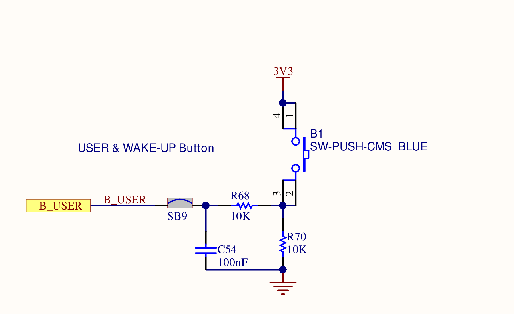

# LAB2-2 - Transmit the button counter over USART1

[Back to the main README](../README.md)

Commit: [`1f0010c`](https://github.com/Sakuya4/NTUT_MCU_LAB/commit/1f0010cbc3fe0aa0231ec4953a3d9c7c1c7a1708)

## Goal

Keep the debounced button counter and LED display from LAB2-1, then send the current count to a computer through USART1 and the board's ST-LINK Virtual COM Port.

## Schematic evidence

### Button and LED circuits




The button remains an active-high `PA0` input with an external pull-down path, and the LEDs remain active-high push-pull outputs on `PJ5` and `PJ13`. The same 20 ms press and release checks from LAB2-1 provide software debounce.

### USART1 pin mapping


The MCU connection sheet maps `PA9` to the `VCP_TX` net and `PA10` to the `VCP_RX` net. These pins support the USART1 asynchronous alternate function, so CubeMX selects `PA9 = USART1_TX` and `PA10 = USART1_RX`.

### ST-LINK Virtual COM Port circuit


The schematic shows the UART directions crossing at the ST-LINK interface:

- MCU `PA9 / VCP_TX` passes through `SB18` to `STLINK_RX`.
- MCU `PA10 / VCP_RX` passes through `SB17` from `STLINK_TX`.
- The ST-LINK MCU transfers the serial data to the computer through the USB ST-LINK connector, where it appears as a Virtual COM Port.

LAB2-2 only calls `HAL_UART_Transmit()`, so the active data path for this lab is `PA9 -> VCP_TX -> STLINK_RX -> USB -> PC`. `PA10` is still configured because USART1 is enabled in TX/RX asynchronous mode.

## User-manual cross-check

[UM2033 Sections 5.15 and 5.16](https://www.st.com/resource/en/user_manual/um2033-discovery-kit-with-stm32f769ni-mcu-stmicroelectronics.pdf) connect this exercise to the physical board: USART1 is exposed through the onboard ST-LINK Virtual COM Port at `CN16`, while blue user button `B1` reads high when pressed.

Configure the PC terminal for `115200` baud, `8` data bits, no parity, `1` stop bit, and no flow control. Table 4 also maps physical green `LD2` to project `LED1 = PJ5` and physical red `LD1` to project `LED2 = PJ13`; LED polarity must be taken from the B-02 schematic.

## CubeMX settings

### GPIO

| Pin | Project label | Mode | Pull | Purpose |
|---|---|---|---|---|
| `PA0/WKUP` | `USER_BUTTON` | GPIO Input | No Pull | Active-high button input |
| `PJ5` | `LED1` | GPIO Output, Push-Pull, Low Speed | No Pull | Counter bit 0 |
| `PJ13` | `LED2` | GPIO Output, Push-Pull, Low Speed | No Pull | Counter bit 1 |

### USART1

| Setting | Value |
|---|---|
| Mode | Asynchronous |
| TX pin | `PA9` |
| RX pin | `PA10` |
| Baud rate | `115200` bit/s |
| Word length | 8 bits |
| Parity | None |
| Stop bits | 1 |
| Hardware flow control | None |
| Oversampling | 16 |

The serial terminal on the computer must use the matching `115200 8-N-1` configuration.

## Initialization order

USART1 must be initialized before entering the LAB2-2 infinite loop:

```c
MX_GPIO_Init();
MX_USART1_UART_Init();
LAB2_2();
```

The UART handle is generated in `main.c` and referenced by the lab module:

```c
extern UART_HandleTypeDef huart1;
```

## Transmission concept

```c
sprintf(message, "Count = %d\r\n", count);
HAL_UART_Transmit(
    &huart1,
    (uint8_t *)message,
    strlen(message),
    HAL_MAX_DELAY
);
```

`sprintf()` converts the numeric counter into text. `\r\n` ends the terminal line, and `strlen()` supplies the number of bytes to transmit. `HAL_UART_Transmit()` uses blocking mode; `HAL_MAX_DELAY` means the call waits without a finite timeout until the transfer completes or an error prevents completion.

The LED assignments are unchanged from LAB2-1, including the current inverted visible representation of the counter bits.

## Expected result

Each accepted button press updates the LEDs and prints one line to the serial terminal:

```text
Count = 1
Count = 2
Count = 3
Count = 0
```

The sequence then repeats.
