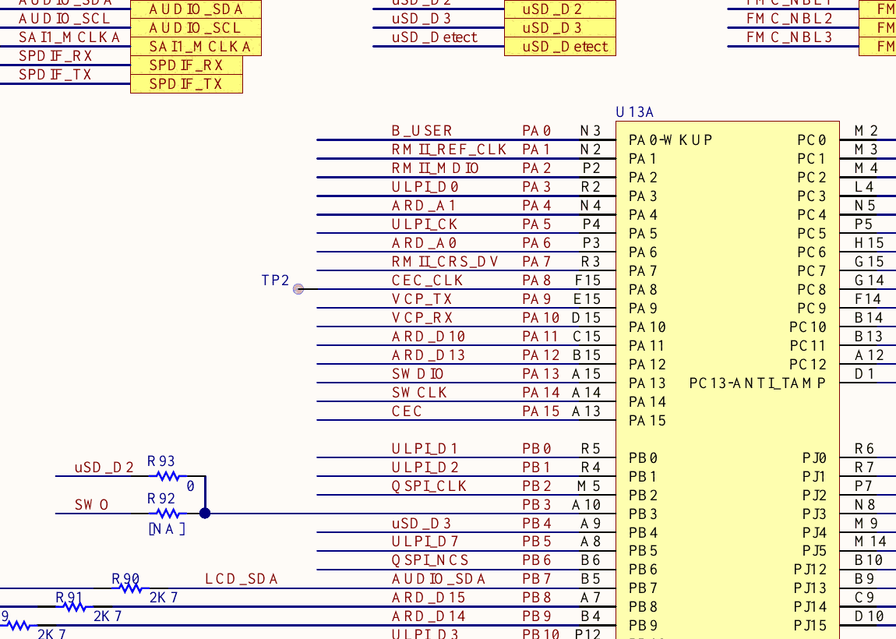
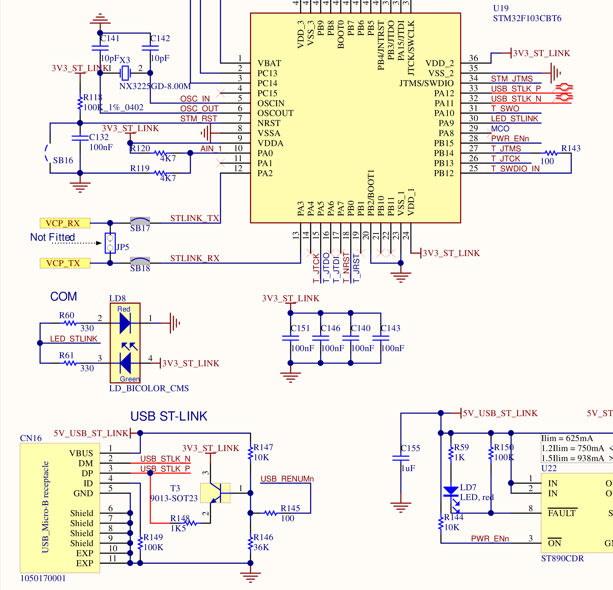

# LAB3-1 - Add two multi-digit integers over UART

[Back to the main README](../README.md)

Commit: [`caaa152`](https://github.com/Sakuya4/NTUT_MCU_LAB/commit/caaa1529eac4a434e0243747399e12578551262e)

## Goal

Receive two complete integer strings from a serial terminal, convert them into signed integers, and transmit their sum back to the computer.

## Schematic evidence

### USART1 pin mapping



The STM32F769 connection sheet labels `PA9` as `VCP_TX` and `PA10` as `VCP_RX`. Therefore, the firmware assigns `PA9` to `USART1_TX` and `PA10` to `USART1_RX` instead of choosing unrelated GPIO pins.

### ST-LINK Virtual COM Port circuit



`VCP_TX` reaches `STLINK_RX` through `SB18`, while `VCP_RX` receives data from `STLINK_TX` through `SB17`. The onboard ST-LINK controller converts this bidirectional UART connection into the USB Virtual COM Port used by the computer.

Unlike the transmit-only message in LAB2-2, this lab actively uses both directions: the terminal sends typed characters through `PA10`, and the firmware sends prompts, character echoes, and results through `PA9`.

## User-manual cross-check

[UM2033 Section 5.15](https://www.st.com/resource/en/user_manual/um2033-discovery-kit-with-stm32f769ni-mcu-stmicroelectronics.pdf) states that USART1 is directly available as the ST-LINK Virtual COM Port through USB connector `CN16`. Therefore, the same data-capable USB cable used for programming also carries the numbers typed on the PC and the addition result returned by the MCU.

Use `115200 8N1` with no flow control. No external USB-to-UART adapter or connection to USB OTG connector `CN15` is required.

## CubeMX settings

| Setting | Value | Reason |
|---|---|---|
| USART1 mode | Asynchronous, transmit and receive | The lab exchanges text in both directions. |
| TX pin | `PA9` | The schematic connects `PA9` to `VCP_TX`. |
| RX pin | `PA10` | The schematic connects `PA10` to `VCP_RX`. |
| Baud rate | `115200` bit/s | The computer terminal must use the same serial speed. |
| Word length | 8 bits | Standard eight-bit terminal characters. |
| Parity / stop bits | None / 1 | Together with the word length, this produces `115200 8-N-1`. |
| Hardware flow control | None | The VCP schematic only provides the TX and RX data connections. |
| Oversampling | 16 | Matches the generated `USART1` initialization. |

Initialize the peripheral before entering the lab function:

```c
MX_GPIO_Init();
MX_USART1_UART_Init();
LAB3_1();
```

## Line-input concept

`UART_ReadLine()` receives one byte at a time with blocking `HAL_UART_Receive()`. Each accepted character is echoed with `HAL_UART_Transmit()`, so the terminal displays the user's input. A carriage return or line feed terminates a nonempty line, and one buffer position is reserved for the terminating `\0` character.

```c
UART_ReadLine(input, sizeof(input));
a = (int32_t)strtol(input, NULL, 10);

UART_ReadLine(input, sizeof(input));
b = (int32_t)strtol(input, NULL, 10);

result = a + b;
```

Reading an entire line before calling `strtol()` allows multi-digit values and optional signs, rather than treating a single received character as the complete number. The current implementation does not add separate numeric-format or arithmetic-overflow checks.

## Expected result

```text
Input a: 125
Input b: -34
a + b = 91
```

After printing the result, the function returns to the first prompt and accepts another pair of integers.
