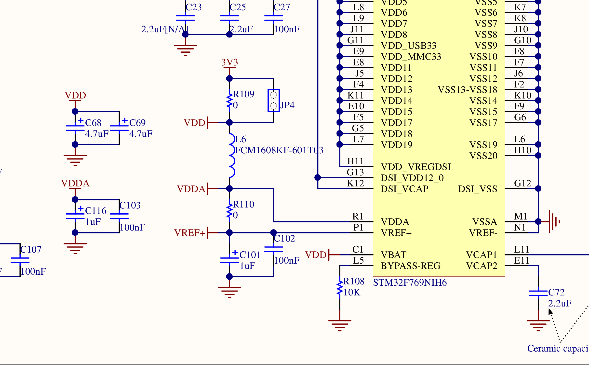
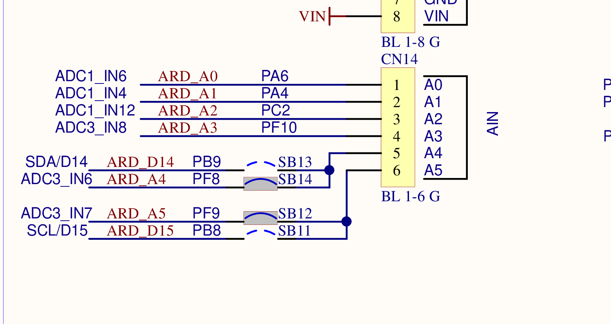
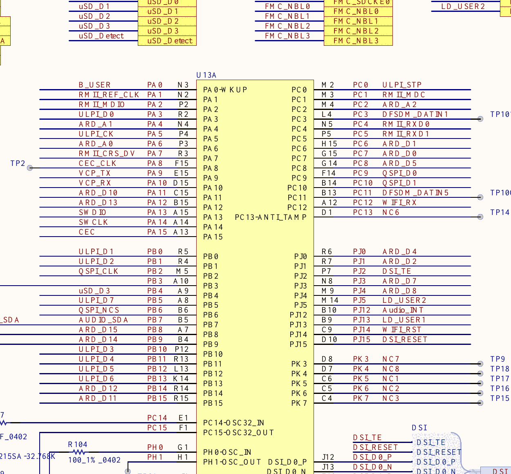
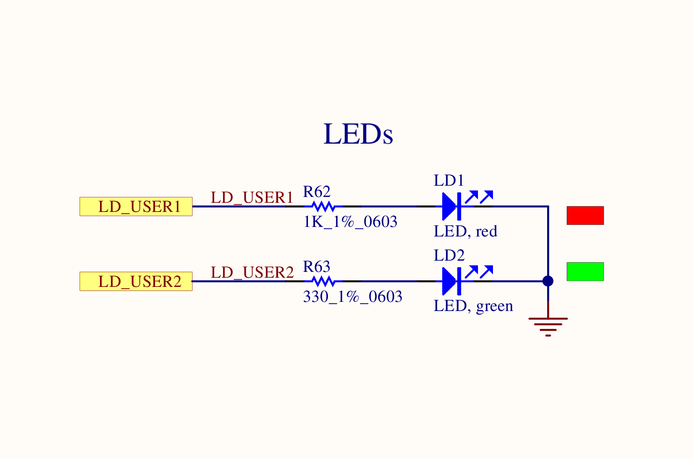

# LAB4-2 - Control LEDs according to the internal temperature

[Back to the main README](../README.md)

Commit: [`23147a1`](https://github.com/Sakuya4/NTUT_MCU_LAB/commit/23147a1155834e988d740dc8d956fcd4930ab92e)

## Goal

Read the STM32F769's internal temperature sensor with ADC1, classify the approximate temperature into four ranges, control the two onboard user LEDs, and report the ADC reading and temperature over USART1.

The exercise uses the board's existing LEDs and internal sensor, so no external potentiometer or additional wiring is necessary.

## Schematic evidence

### ADC analog supply and available external inputs



The schematic shows the MCU's `VDDA`, `VSSA`, `VREF+`, and `VREF-` connections, together with the filtered `3V3` analog supply and local decoupling. These connections support the firmware's approximate `3300 mV` ADC-reference assumption.



The board also exposes external ADC inputs, including `A0 / PA6 / ADC1_IN6`, `A1 / PA4 / ADC1_IN4`, and `A2 / PC2 / ADC1_IN12`. None of these external pins is configured in this exercise: the selected source is the internal `ADC_CHANNEL_TEMPSENSOR`, which ST identifies as an internal ADC1 input in [the STM32F769NI datasheet, Section 3.43](https://www.st.com/resource/en/datasheet/stm32f769ni.pdf).

### MCU GPIO connections and user LED circuits





The MCU connection sheet routes the user LED nets to GPIO port J, and the user-LED schematic shows the LED and series-resistor connections. The existing project labels assign `LED1` to `PJ5` and `LED2` to `PJ13`.

These LED circuits are active high: writing `GPIO_PIN_SET` turns the associated LED on, while writing `GPIO_PIN_RESET` turns it off. Therefore, both GPIO pins are configured as push-pull outputs without internal pull resistors.

### USART1 and ST-LINK serial connection


`PA9` is connected to `VCP_TX`, and `PA10` is connected to `VCP_RX`. The board routes MCU transmission through `VCP_TX -> SB18 -> STLINK_RX`, allowing the ST-LINK USB connection to present the temperature messages on the computer's Virtual COM Port.

## User-manual cross-check

[UM2033 Sections 5.15, 5.16, and 6.2](https://www.st.com/resource/en/user_manual/um2033-discovery-kit-with-stm32f769ni-mcu-stmicroelectronics.pdf) identify the relevant board hardware. USART1 reaches the PC through `CN16`; physical green `LD2` uses `PJ5`; and physical red `LD1` uses `PJ13`.

The analog `CN14` header described in Table 6 is not needed because the selected ADC source is the internal temperature sensor. Configure the terminal for `115200 8N1`, and follow the B-02 schematic for active-high LED polarity rather than the manual's contradictory LED sentence.

## CubeMX settings

### ADC1

| Setting | Current value | Reason |
|---|---|---|
| ADC instance | `ADC1` | Provides access to the internal temperature-sensor channel. |
| Input channel | `ADC_CHANNEL_TEMPSENSOR` | Avoids an external analog pin or potentiometer. |
| CubeMX signal | `VP_ADC1_TempSens_Input` | Represents the internal sensor connection. |
| Resolution | 12 bits | Produces an ADC count between `0` and `4095`. |
| Clock prescaler | `ADC_CLOCK_SYNC_PCLK_DIV2` | Sets the current ADC clock to approximately `8 MHz`. |
| Continuous conversion | Disabled | The loop explicitly starts each conversion. |
| Trigger | Software start | No timer or external trigger is required. |
| Number of conversions | `1` | Only one ADC channel is read. |
| Sampling time | `ADC_SAMPLETIME_3CYCLES` | Matches the current code; see the accuracy note below. |

### User LEDs

| Project signal | MCU pin | GPIO mode | Active state |
|---|---|---|---|
| `LED1` | `PJ5` | Push-pull output, low speed, no pull | `GPIO_PIN_SET` |
| `LED2` | `PJ13` | Push-pull output, low speed, no pull | `GPIO_PIN_SET` |

### USART1

| Setting | Value |
|---|---|
| TX pin | `PA9` |
| RX pin | `PA10` |
| Mode | Asynchronous, transmit and receive |
| Baud rate and frame | `115200 8-N-1` |
| Hardware flow control | None |

## Initialization order

The current `main.c` initializes GPIO, UART, and ADC before entering LAB4-2:

```c
MX_GPIO_Init();
MX_USART1_UART_Init();
MX_ADC1_Init();
LAB4_2();
```

## Temperature-conversion concept

Each loop performs a single blocking ADC conversion:

```c
HAL_ADC_Start(&hadc1);
HAL_ADC_PollForConversion(&hadc1, HAL_MAX_DELAY);
adcValue = HAL_ADC_GetValue(&hadc1);
HAL_ADC_Stop(&hadc1);
```

The firmware first estimates the sensor voltage from the 12-bit ADC count, then estimates the chip temperature:

```c
voltageMv = (adcValue * 3300) / 4095;
temperature = ((voltageMv - 760) * 10 / 25) + 25;
```

`3300` represents the assumed `3.3 V` reference, `4095` is the full-scale 12-bit count, `760 mV` is the typical sensor voltage at `25 C`, and `2.5 mV/C` is the typical sensor slope. ST documents those sensor characteristics in [the STM32F769NI datasheet, Table 78](https://www.st.com/resource/en/datasheet/stm32f769ni.pdf).

The reported result is an approximate internal die temperature rather than a calibrated ambient temperature.

## Temperature-to-LED behavior

| Estimated temperature | `LED1` on `PJ5` | `LED2` on `PJ13` | Firmware action |
|---|---|---|---|
| Below `30 C` | Toggle | Toggle | Invert both GPIO output states. |
| `30 C` to below `35 C` | On | Off | Set `LED1` and reset `LED2`. |
| `35 C` to below `40 C` | Off | On | Reset `LED1` and set `LED2`. |
| `40 C` or above | On | On | Set both LED outputs. |

The lowest-temperature case toggles both outputs but does not first force them into the same state:

```c
HAL_GPIO_TogglePin(LED1_GPIO_Port, LED1_Pin | LED2_Pin);
HAL_Delay(500);
```

At startup, `MX_GPIO_Init()` sets `LED1` and resets `LED2`, so the two LEDs initially alternate in this range. If the state changes from another temperature range before entering the toggle case, the visible blink relationship follows those existing states instead.

The low-temperature branch contains an additional `500 ms` delay before the shared `500 ms` delay at the end of the loop, so its outputs toggle approximately once per second. The other temperature ranges update approximately every `500 ms`.

## Sampling-time accuracy note

The current clock configuration gives an ADC clock of approximately `8 MHz`, so `ADC_SAMPLETIME_3CYCLES` samples for only `0.375 us`. ST specifies at least `10 us` when reading the internal temperature sensor for `1 C` accuracy in [the STM32F769NI datasheet, Table 78](https://www.st.com/resource/en/datasheet/stm32f769ni.pdf).

At the current clock frequency, `ADC_SAMPLETIME_84CYCLES` would provide `10.5 us` and meet that minimum. Until the sampling configuration is changed, the displayed temperature and LED thresholds should be treated as approximate demonstrations rather than accurate calibrated measurements.

## Expected result

The serial terminal prints the raw ADC value and calculated temperature:

```text
ADC = 960, Temperature = 30 C
ADC = 963, Temperature = 31 C
ADC = 975, Temperature = 35 C
ADC = 1000, Temperature = 43 C
```

As the reported temperature moves between ranges, the two onboard LEDs change according to the four states listed above.
